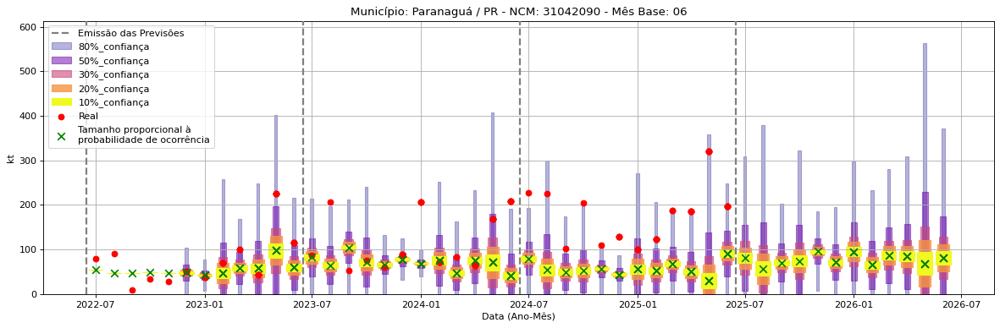
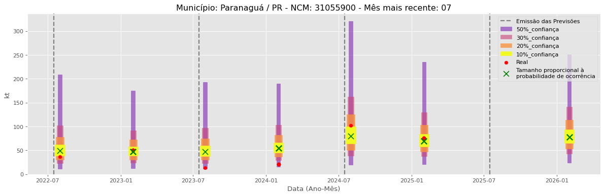

<header>
    <h1><a href="https://quantimportbrazil.github.io/Sobre/">QuantImport</a></h1>
</header>

---

# Previsão de Importação - Paranaguá-PR

> **Emissão:** 06-2025
> Para fins de comparação, também apresentamos a seguir previsões e valores reais de períodos anteriores ao atual.
> As previsões foram geradas com base em dados limitados até o mês 6.

---

**[Home](https://quantimportbrazil.github.io/Sobre/)** | **[Selecionar Estado (UF)](https://quantimportbrazil.github.io/Unidades_Federativas/)**

Fator de Influência em Destaque:

Previsão Influenciada:
- Município: Paranaguá
- Produto (NCM): Outros cloretos de potássio-31042090 
- Mês previsto: 07

Fator Influenciador:
- Município: Maringá
- Elemento: Sementes e frutos oleaginosos; grãos, sementes e frutos diversos; plantas industriais ou medicinais; palhas e forragens
- Mês previsto: 07
- Unidade: kt_lag12

Fator de Influência em Destaque:

Previsão Influenciada:
- Município: Paranaguá
- Produto (NCM): Diidrogeno-ortofosfato de amônio (fosfato monoamônico ou monoamoniacal), mesmo misturado com hidrogeno-ortofosfato de diamônio (fosfato diamônico ou diamoniacal)-31054000 
- Mês previsto: 07

Fator Influenciador:
- Município: Goiânia
- Elemento: Sementes e frutos oleaginosos; grãos, sementes e frutos diversos; plantas industriais ou medicinais; palhas e forragens
- Mês previsto: 07
- Unidade: kt_lag24

Fator de Influência em Destaque:

Previsão Influenciada:
- Município: Paranaguá
- Produto (NCM): Outros adubos/fertilizantes minerais químicos, com nitrogênio e fósforo-31055900 
- Mês previsto: 07

Fator Influenciador:
- Município: Porto Alegre
- Elemento: Sementes e frutos oleaginosos; grãos, sementes e frutos diversos; plantas industriais ou medicinais; palhas e forragens
- Mês previsto: 07
- Unidade: sm_diff

