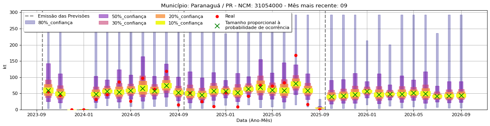

#  [QuantImport](https://quantimportbrazil.github.io/Sobre/)

---

# Fator mais Importante — Demonstração

> **Emissão:** 10-2025  
> O nosso sistema de aprendizado de máquinas (ML) não somente gera previsões como também lista e quantifica a importância dos fatores que as explicam.

---

**[Home](https://quantimportbrazil.github.io/Sobre/)**

Para demonstrar a análise de importância dos fatores nas previsões, selecionamos a previsão demonstrativa que apresentou a maior variação percentual: 
   * O produto NCM 31054000 para o município de Paranaguá‑PR no mês 09, de 2025 para 2026, que se pode ver no gráfico a seguir:

Observações sobre o gráfico no mês 09:
- Em 2025:  
  * a ausência do marcador "X" verde no centro da previsão indicava grande probabilidade da importação nem mesmo ocorrer.
  * Caso a importação mesmo assim ocorrasse, a previsão é que ela seria de aproximadamente 5 kt
- Para 2026:
  * a presença e o tamanho do marcador "X" verde no centro da previsão indica grande probabilidade da importação ocorrer.
  * ela ocorrendo, a previsão é que ela seja próxima de 50 kt.

Neste caso específico, nosso sistema identificou que vários fatores contribuíram para essa grande alteração e que, dentre os fatores, o que mais se destacou foi a forte desaceleração da importação do mesmo grupo de produto na região de Barreiras/BA, como se pode ver no gráfico a seguir:

Isso é um exemplo de, ao se prever importações de um determinado município, se analisar conjuntamente os demais municípios do Brasil, mesmo em municípios distantes e não abastecidos diretamente pelo município que esta sendo previsto! Nesse caso o autor entende que A região de Barreiras/BA demandará por produto de regiões mais ao sul, criando uma onda de impacto no mercado que atingirá Paranaguá/PR. Nosso sistema previu isso porque identificou comportamentos como esse no histórico a ele fornecido.

---

## Notas Técnicas
* `*` Mesmo os valores aqui considerados reais são estimativas de nosso sistema, pois os dados divulgados não apresentam tal granularidade.  

---

## Contato
**André Coutinho Bueno**  
Cientista de Dados e Fundador  
[andre.bueno@quantimport.com.br](mailto:andre.bueno@quantimport.com.br)
